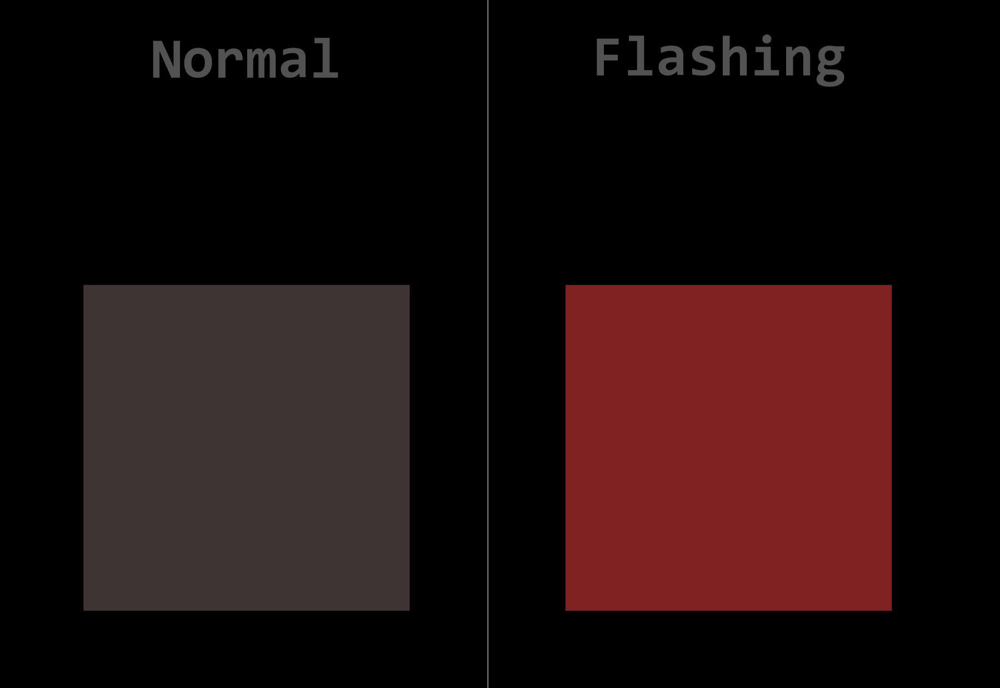
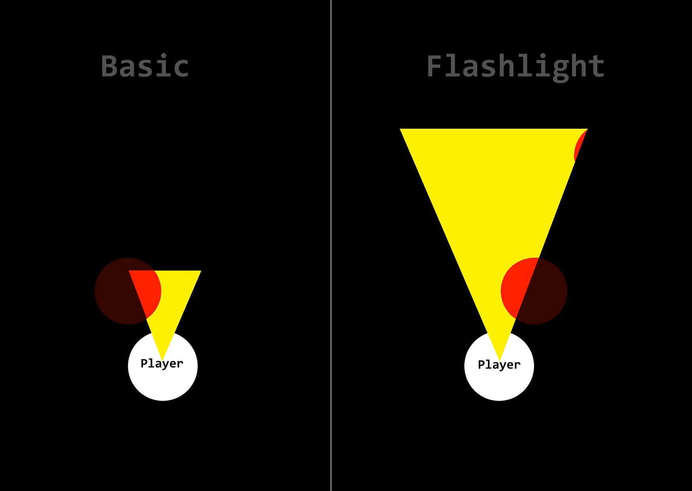

# Stage 3: Technical Documentation & System Design - User stories

## Sommaire

## Core Gameplay

### User Story: Player Movement  

#### 📌 Description  
As a player, I want to move my character in the game, so that I can navigate the map.

#### 🎯 Acceptance Criteria (Definition of Done ✅)  
- ✅ The player can move up, down, left, and right using W, A, S, D or arrow keys.  
- ✅ The movement is smooth and responsive.  
- ✅ The player cannot move outside the boundaries of the map.  

#### 🔄 Priority (MoSCoW)  
🟥 Must Have  

#### 📝 Scenario  
**Given** the player is in a game session,  
**When** they press W, A, S, or D (or arrow keys),  
**Then** the character moves in the corresponding direction.  
**And** when they release the key, the character stops moving.  

#### 🏗️ Technical Notes  
- The movement should be **smooth** and **responsive**.  
- The player should not be able to move outside the map boundaries.  
- Implement using the **keyboard event listener** in JavaScript.  
- The movement logic should update the **player's position** in real time. 

#### 🛠️ Tasks  
- [ ] Detect key presses (Z, Q, S, D or Arrow Keys).  
- [ ] Update player position based on input.  
- [ ] Prevent movement outside the map.  
- [ ] Ensure smooth animation when moving.  

#### 🔗 Dependencies  
- Collision detection system  
- Game map boundaries  

#### 🎨 Mockup (If Applicable)  
*No mockup needed for basic movement.*  

---

### User Story: Melee Combat

#### 📌 Description  
"As a player, I want to be able to attack other players in melee combat, so that fight other players."

#### 🎯 Acceptance Criteria (Definition of Done ✅)  
- ✅ The player can initiate a melee attack by pressing a designated key (`Space` or `left click`)
- ✅ Enemies within melee range take damage upon attack.
- ✅ Attack animation when attack key pressed *(not sure yet)*  

#### 🔄 Priority (MoSCoW)  
🟥 Must Have  

#### 📝 Scenario  
**Given** the player is in a game session
**When** they press the melee attack key (`Space` or `left click`)
**Then** the character performs a basic melee attack animation.
**And** if an enemy is within range, they are eliminated

#### 🏗️ Technical Notes  
- Use **event listeners** to detect attack inputs.
- Implement hit detection to check if an enemy is within range.
- Maybe adding a cooldown ? *Not decided yet*

#### 🛠️ Tasks  
- [ ] Detect attack key press (Space or Left Click).
- [ ] Trigger potential animation (not sure yet)
- [ ] Apply elimination to enemies hit

#### 🔗 Dependencies  
- Enemy hitbox detection system

#### 🎨 Mockup (If Applicable)  
*No mockup needed for basic movement.*  

---

### User Story: Health System  

#### 📌 Description  
As a player, I want a health system to manage damage taken, so that I can track my survival status in the game.  

#### 🎯 Acceptance Criteria (Definition of Done ✅)  
- ✅ The player has a health value that decreases when taking damage.  
- ✅ The player dies instantly when reaching 0 HP.  
- ✅ The game processes the player's death correctly (game over screen).  

#### 🔄 Priority (MoSCoW)  
❌ Won't Have (Not required for MVP)  

#### 📝 Scenario  
**Given** the player is in a game session,  
**When** they take damage from an enemy or hazard,  
**Then** their health drops to zero.  
**And** the game triggers the game over.  

#### 🏗️ Technical Notes  
- The player does not have a health bar for now.  
- Any hit results in **instant death** instead of reducing health over time.  
- Implement **death logic** rather than a full health system.  

#### 🛠️ Tasks  
- [ ] Detect when the player takes damage.  
- [ ] Trigger instant death upon damage.  
- [ ] Implement game over.  

#### 🔗 Dependencies  
- Collision detection system  
- Game over system  

#### 🎨 Mockup (If Applicable)  
*No mockup needed for this feature in MVP.*  

___

### User Story: Map Destruction (Falling Tiles)  

#### 📌 Description  
As a player, I want tiles of the map to fall randomly, so that I must stay aware of my surroundings and adapt to the changing environment.  

#### 🎯 Acceptance Criteria (Definition of Done ✅)  
- ✅ Certain tiles are randomly selected to fall after a set time.  
- ✅ When a tile falls, it disappears and becomes an empty space.  
- ✅ Players standing on a falling tile die instantly.  
- ✅ The falling pattern should be unpredictable but balanced for gameplay.  

#### 🔄 Priority (MoSCoW)  
🟥 Must Have  

#### 📝 Scenario  
**Given** the player is in a game session,  
**When** a tile is selected to fall,  
**Then** the tile visually disappears after a short warning period.  
**And** if the player is on that tile, they die instantly.  

#### 🏗️ Technical Notes  
- Implement a **random timer** to determine which tiles fall.  
- Use a **visual warning** (flashing or shaking) before a tile falls.  
- Ensure tiles cannot fall too quickly or unfairly.  
- Update the **collision system** so fallen tiles are no longer walkable.  

#### 🛠️ Tasks  
- [ ] Implement tile selection logic for falling.  
- [ ] Add a warning animation before a tile disappears.  
- [ ] Update collision detection to prevent walking on fallen tiles.  
- [ ] Handle player death when standing on a falling tile.  

#### 🔗 Dependencies  
- Collision detection system  
- Player movement system  
- Death handling system  

#### 🎨 Mockup (If Applicable)  
 

___

### User Story: Flashlight System  

#### 📌 Description  
As a player, I want to be able to use a flashlight, so that I can find my ennemies

#### 🎯 Acceptance Criteria (Definition of Done ✅)  
- ✅ The flashlight can be toggled on and off by pressing a F key.  
- ✅ The flashlight illuminates the infront the player within a certain radius.  
- ✅ The flashlight’s beam direction can be adjusted by moving the mouse or the character’s view.

#### 🔄 Priority (MoSCoW)  
🟥 Must Have  

#### 📝 Scenario  
**Given** the player is in a dark area,  
**When** they press the F key,  
**Then** the flashlight turns on and illuminates a cone infront the player.  
**And** when they press the F key again, the flashlight turns off.   

#### 🏗️ Technical Notes  
- The flashlight should be **toggleable** with a keypress (F)
- The flashlight's beam direction should follow the player's view or mouse movement.  
- The **lighting effect** should be created in the game engine, adjusting the illuminated area based on flashlight's position and direction.  

#### 🛠️ Tasks  
- [ ] Detect key press for flashlight toggle (F).  
- [ ] Implement flashlight lighting effect based on player position and view direction.  
- [ ] Add functionality to adjust the flashlight beam's direction based on player’s orientation.  

#### 🔗 Dependencies  
- Lighting system  
- Game environment

#### 🎨 Mockup (If Applicable)  

