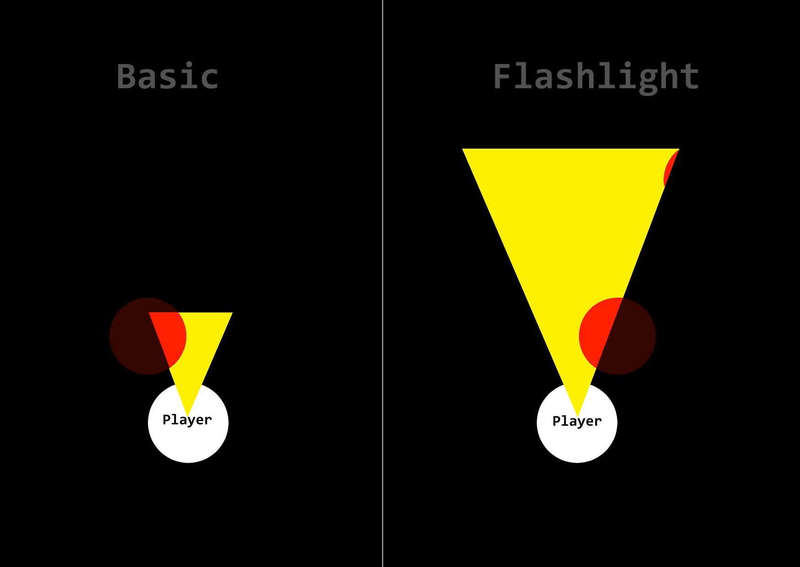
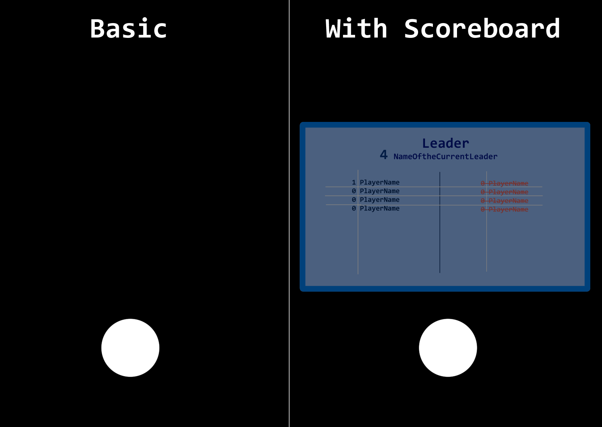
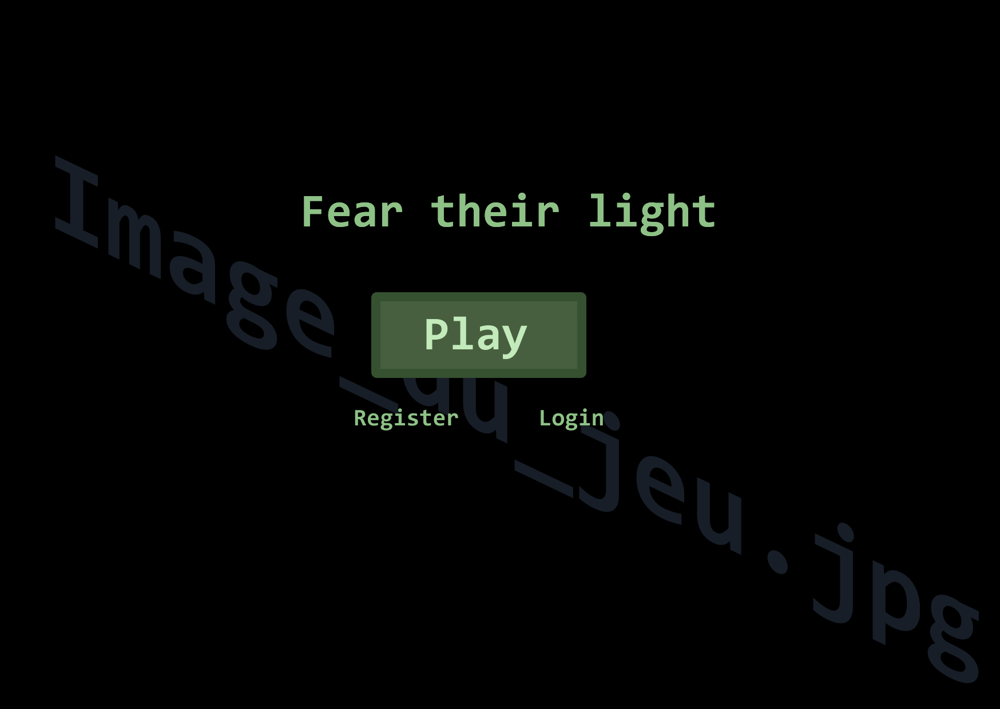

# Stage 3: Technical Documentation & System Design - User stories

  [Stage 3: Technical Documentation \& System Design - User stories](#stage-3-technical-documentation--system-design---user-stories)
  - [Sommaire](#sommaire)
  - [🎮 Core Gameplay](#-core-gameplay)
    - [User Story: Player Movement](#user-story-player-movement)
    - [User Story: Melee Combat](#user-story-melee-combat)
    - [User Story: Health System](#user-story-health-system)
    - [User Story: Map Destruction (Falling Tiles)](#user-story-map-destruction-falling-tiles)
    - [User Story: Flashlight System](#user-story-flashlight-system)
  - [🛠️ Management](#️-game-management)
    - [User Story: Multiplayer Session](#user-story-multiplayer-session)
    - [User Story: Hitbox System](#user-story-hitbox-system)
    - [User Story: Scoreboard System](#user-story-scoreboard-system)
    - [User Story: Prevent Multi-Instances](#user-story-prevent-multi-instances)
    - [User Story: Account Creation](#user-story-account-creation)
    - [User Story: User Authentication](#user-story-user-authentication)

## 🎮 Core Gameplay

### User Story: Player Movement  

#### 📌 Description  
As a player, I want to move my character in the game, so that I can navigate the map.

#### 🎯 Acceptance Criteria (Definition of Done ✅)  
- ✅ The player can move up, down, left, and right using W, A, S, D or arrow keys.  
- ✅ The movement is smooth and responsive.  
- ✅ The player cannot move outside the boundaries of the map.  

#### 🔄 Priority (MoSCoW)  
🟥 Must Have  

#### 📝 Scenario  
**Given** the player is in a game session,  
**When** they press W, A, S, or D (or arrow keys),  
**Then** the character moves in the corresponding direction.  
**And** when they release the key, the character stops moving.  

#### 🏗️ Technical Notes  
- The movement should be **smooth** and **responsive**.  
- The player should not be able to move outside the map boundaries.  
- Implement using the **keyboard event listener** in JavaScript.  
- The movement logic should update the **player's position** in real time. 

#### 🛠️ Tasks  
- [ ] Detect key presses (Z, Q, S, D or Arrow Keys).  
- [ ] Update player position based on input.  
- [ ] Prevent movement outside the map.  
- [ ] Ensure smooth animation when moving.  

#### 🔗 Dependencies  
- Collision detection system  
- Game map boundaries  

#### 🎨 Mockup   
*No mockup needed for basic movement.*  

---

### User Story: Melee Combat

#### 📌 Description  
"As a player, I want to be able to attack other players in melee combat, so that fight other players."

#### 🎯 Acceptance Criteria (Definition of Done ✅)  
- ✅ The player can initiate a melee attack by pressing a designated key (`Space` or `left click`)
- ✅ Enemies within melee range take damage upon attack.
- ✅ Attack animation when attack key pressed *(not sure yet)*  

#### 🔄 Priority (MoSCoW)  
🟥 Must Have  

#### 📝 Scenario  
**Given** the player is in a game session
**When** they press the melee attack key (`Space` or `left click`)
**Then** the character performs a basic melee attack animation.
**And** if an enemy is within range, they are eliminated

#### 🏗️ Technical Notes  
- Use **event listeners** to detect attack inputs.
- Implement hit detection to check if an enemy is within range.
- Maybe adding a cooldown ? *Not decided yet*

#### 🛠️ Tasks  
- [ ] Detect attack key press (Space or Left Click).
- [ ] Trigger potential animation (not sure yet)
- [ ] Apply elimination to enemies hit

#### 🔗 Dependencies  
- Enemy hitbox detection system

#### 🎨 Mockup   
*No mockup needed for basic movement.*  

---

### User Story: Health System  

#### 📌 Description  
As a player, I want a health system to manage damage taken, so that I can track my survival status in the game.  

#### 🎯 Acceptance Criteria (Definition of Done ✅)  
- ✅ The player has a health value that decreases when taking damage.  
- ✅ The player dies instantly when reaching 0 HP.  
- ✅ The game processes the player's death correctly (game over screen).  

#### 🔄 Priority (MoSCoW)  
❌ Won't Have (Not required for MVP)  

#### 📝 Scenario  
**Given** the player is in a game session,  
**When** they take damage from an enemy or hazard,  
**Then** their health drops to zero.  
**And** the game triggers the game over.  

#### 🏗️ Technical Notes  
- The player does not have a health bar for now.  
- Any hit results in **instant death** instead of reducing health over time.  
- Implement **death logic** rather than a full health system.  

#### 🛠️ Tasks  
- [ ] Detect when the player takes damage.  
- [ ] Trigger instant death upon damage.  
- [ ] Implement game over.  

#### 🔗 Dependencies  
- Collision detection system  
- Game over system  

#### 🎨 Mockup   
*No mockup needed for this feature in MVP.*  

___

### User Story: Map Destruction (Falling Tiles)  

#### 📌 Description  
As a player, I want tiles of the map to fall randomly, so that I must stay aware of my surroundings and adapt to the changing environment.  

#### 🎯 Acceptance Criteria (Definition of Done ✅)  
- ✅ Certain tiles are randomly selected to fall after a set time.  
- ✅ When a tile falls, it disappears and becomes an empty space.  
- ✅ Players standing on a falling tile die instantly.  
- ✅ The falling pattern should be unpredictable but balanced for gameplay.  

#### 🔄 Priority (MoSCoW)  
🟥 Must Have  

#### 📝 Scenario  
**Given** the player is in a game session,  
**When** a tile is selected to fall,  
**Then** the tile visually disappears after a short warning period.  
**And** if the player is on that tile, they die instantly.  

#### 🏗️ Technical Notes  
- Implement a **random timer** to determine which tiles fall.  
- Use a **visual warning** (flashing or shaking) before a tile falls.  
- Ensure tiles cannot fall too quickly or unfairly.  
- Update the **collision system** so fallen tiles are no longer walkable.  

#### 🛠️ Tasks  
- [ ] Implement tile selection logic for falling.  
- [ ] Add a warning animation before a tile disappears.  
- [ ] Update collision detection to prevent walking on fallen tiles.  
- [ ] Handle player death when standing on a falling tile.  

#### 🔗 Dependencies  
- Collision detection system  
- Player movement system  
- Death handling system  

#### 🎨 Mockup   
 

___

### User Story: Flashlight System  

#### 📌 Description  
As a player, I want to be able to use a flashlight, so that I can find my ennemies

#### 🎯 Acceptance Criteria (Definition of Done ✅)  
- ✅ The flashlight can be toggled on and off by pressing a F key.  
- ✅ The flashlight illuminates the infront the player within a certain radius.  
- ✅ The flashlight’s beam direction can be adjusted by moving the mouse or the character’s view.

#### 🔄 Priority (MoSCoW)  
🟥 Must Have  

#### 📝 Scenario  
**Given** the player is in a dark area,  
**When** they press the F key,  
**Then** the flashlight turns on and illuminates a cone infront the player.  
**And** when they press the F key again, the flashlight turns off.   

#### 🏗️ Technical Notes  
- The flashlight should be **toggleable** with a keypress (F)
- The flashlight's beam direction should follow the player's view or mouse movement.  
- The **lighting effect** should be created in the game engine, adjusting the illuminated area based on flashlight's position and direction.  

#### 🛠️ Tasks  
- [ ] Detect key press for flashlight toggle (F).  
- [ ] Implement flashlight lighting effect based on player position and view direction.  
- [ ] Add functionality to adjust the flashlight beam's direction based on player’s orientation.  

#### 🔗 Dependencies  
- Lighting system  
- Game environment

#### 🎨 Mockup   

___

### User Story: Hitbox System  

#### 📌 Description  
As a player, I want the game to have a hitbox system, so that my character can interact with objects and other players in a realistic way.

#### 🎯 Acceptance Criteria (Definition of Done ✅)  
- ✅ The hitbox correctly detects collisions between characters, actions and objects (attacks, enemies).  
- ✅ The hitbox updates in real time, accurately representing the character's position and movements.  
- ✅ The hitbox prevents the character from moving through objects or other players.

#### 🔄 Priority (MoSCoW)  
🟥 Must Have  

#### 📝 Scenario  
**Given** the player is moving through the game world,  
**When** they interact with another player,  
**Then** the hitbox system detects the collision and responds accordingly.  
**And** the player is prevented from moving through characters.
**And** the hitbox updates dynamically with the player’s movements and actions (such as being attacked and dying).

#### 🏗️ Technical Notes  
- **Hitbox shape:** The hitbox should be represented as a circle.
- **Collision detection:** Use **bounding box** or **circle-based** collision detection to identify when two hitboxes overlap.  
- **Real-time updates:** The hitbox should update every frame to follow the player's movement and actions.  
- **Optimizations:** Optimize the hitbox system to handle multiple players and objects without causing lag or performance issues.   

#### 🛠️ Tasks  
- [ ] Create the **hitbox shape** for the player.  
- [ ] Implement **collision detection** between player hitbox and environment objects (e.g., walls, obstacles).   
- [ ] Ensure the hitbox updates in **real-time** as the player moves.  

#### 🔗 Dependencies  
- Physics engine (for accurate collision detection and response)  
- Character movement system (to update hitbox position based on player movement) 

#### 🎨 Mockup   
*No mockup needed for basic hitbox functionality, but hitboxes could be visualized as debug shapes during testing.*

____

### User Story: Scoreboard System  

#### 📌 Description  
As a player, I want to see a scoreboard, so that I can track my performance and compare my score with other players.

#### 🎯 Acceptance Criteria (Definition of Done ✅)  
- ✅ The scoreboard displays player names and their respective scores.  
- ✅ The scoreboard updates in real time as scores change.  
- ✅ The scoreboard supports multiple players in a multiplayer session.  
- ✅ The scoreboard is accessible at any time during gameplay.  
- ✅ The scoreboard correctly sorts players based on their scores (highest to lowest).
- ✅ The scoreboard remains visible after the game ends to display final rankings.  

#### 🔄 Priority (MoSCoW)  
🟧 Should Have

#### 📝 Scenario  
**Given** the player is in a game session,  
**When** they eliminate an ennemy, they earn a "kill" 
**Then** their score updates on the scoreboard in real time.  
**And** the scoreboard updates dynamically for all players in a multiplayer session.  
**And** players can view the scoreboard at any time during the game.  
**And** the scoreboard remains visible at the end of the game for final rankings.  

#### 🏗️ Technical Notes  
- **Real-time updates:** Ensure the scoreboard updates dynamically whenever a player’s score changes.  
- **Sorting system:** Implement automatic sorting to display the highest scores at the top.  
- **Multiplayer integration:** Synchronize the scoreboard across all players in a multiplayer session.  
- **UI accessibility:** Make the scoreboard accessible via a button press or menu.  
- **Post-game visibility:** Keep the scoreboard visible after the match ends for final review.  

#### 🛠️ Tasks  
- [ ] Create a **UI component** to display player scores.  
- [ ] Implement **real-time score updates** for individual players.  
- [ ] Ensure **multiplayer synchronization** of the scoreboard.  
- [ ] Implement **sorting logic** to rank players based on their scores.  
- [ ] Make the scoreboard **accessible** via a button press or in-game menu.  
- [ ] Keep the scoreboard **visible post-game** for final score review.  

#### 🔗 Dependencies  
- Player scoring system (to count number of kill and update scores)  
- Multiplayer session system (to synchronize scores across players)  
- UI system (to display and update the scoreboard in real time)  

#### 🎨 Mockup   

___

## 🛠️ Management

### User Story: Multiplayer Session  

#### 📌 Description  
As a player, I want to join a game session, so that I can play with other people.

#### 🎯 Acceptance Criteria (Definition of Done ✅)   
- ✅ The player can join a wait room to join a session.
- ✅ The player can view other players in the session, with their actions synchronized in real time.  
- ✅ The player can leave the session at any time, and their exit does not disrupt the other players.  
- ✅ The session should handle player disconnections gracefully, allowing players to reconnect if they disconnect unexpectedly.  

#### 🔄 Priority (MoSCoW)  
🟥 Must Have  

#### 📝 Scenario  
**Given** the player on the welcome screen,  
**When** they select to play a game, 
**Then** they are successfully connected to the session with other players.  
**And** they can see and interact with other players in the game world.  
**And** they can leave or disconnect from the session without negatively affecting the other players.  

#### 🏗️ Technical Notes  
- **Session management:** Implement a system that allows players to either join existing sessions or create new ones.  
- **Real-time synchronization:** Ensure player actions, movements, and interactions are synchronized across all players in the session.  
- **Networking:** The session should handle network latency, ensuring smooth gameplay even with multiple players.  
- **Player disconnection:** Players should be able to disconnect without affecting the gameplay for others.  

#### 🛠️ Tasks  
- [ ] Create a **wait room**  
- [ ] Develop real-time **player synchronization** (position, actions, interactions).  
- [ ] Handle **disconnection** events to maintain session stability.  
- [ ] Ensure players can **leave** the session without causing disruption.  

#### 🔗 Dependencies  
- Network system (to handle multiplayer connections)  
- Synchronization system (for real-time gameplay)   
- Session management (for joining, creating, and leaving sessions)  

#### 🎨 Mockup   
*No mockup needed for basic multiplayer session functionality.*

___

### User Story: Prevent Multi-Instances  

#### 📌 Description  
As a player, I want to prevent multiple instances of the game from running simultaneously, so that I avoid conflicts and unintended behavior.

#### 🎯 Acceptance Criteria (Definition of Done ✅)  
- ✅ The game detects if another instance is already running.  
- ✅ If another instance is detected, the new instance does not launch or prompts the player to close the existing one.  
- ✅ The system prevents launching multiple instances even if the game is started from different shortcuts or executables.  
- ✅ The check works across different operating systems (Windows, macOS, Linux).  
- ✅ The prevention method does not interfere with legitimate game operations.  

#### 🔄 Priority (MoSCoW)  
🟥 Must Have  

#### 📝 Scenario  
**Given** the player attempts to launch the game,  
**When** another instance of the game is already running,  
**Then** the new instance does not start or prompts the player to close the existing instance.  
**And** the system ensures that only one instance of the game runs at a time.  

#### 🏗️ Technical Notes  
- **Check IP:** Check if the current IP is already in a game or the username 
- **User notification:** Provide a clear message if a second instance is attempted.  
- **Performance impact:** The check should be lightweight and not affect game performance.  

#### 🛠️ Tasks  
- [ ] Implement **IP and username check**
- [ ] Ensure the system **detects an existing instance** before launching a new one.  
- [ ] Display a **user-friendly message** if another instance is detected.  
- [ ] Test the solution across **different operating systems**.  
- [ ] Optimize to avoid unnecessary resource consumption.  

#### 🔗 Dependencies  
- Operating system APIs for process management  
- UI system for displaying messages to the player  

#### 🎨 Mockup   
*No mockup needed for this functionality*

___

### User Story: Account Creation  

#### 📌 Description  
As a new player, I want to create an account, so that I can save my progress.  

#### 🎯 Acceptance Criteria (Definition of Done ✅)  
- ✅ Players can register using a unique **username** and **password**.  
- ✅ Players can optionally register using an **email** for account recovery.  
- ✅ Passwords are securely stored using **encryption** (hashing with salt).  
- ✅ The system prevents duplicate usernames.  
- ✅ The system provides error messages for invalid inputs (weak password, already taken username).    
- ✅ The account is successfully created and saved in the database.  

#### 🔄 Priority (MoSCoW)  
🟥 Must Have  

#### 📝 Scenario  
**Given** a new player wants to create an account,  
**When** they enter a unique username, password, and optional email,  
**Then** the system validates their input.  
**And** if the information is correct, the account is created successfully.  
**And** if the username is taken or the password is weak, the player receives an appropriate error message.  

#### 🏗️ Technical Notes  
- **Security:** Store passwords securely using **bcrypt** or another hashing method.  
- **Validation:** Check for **unique usernames**, valid email formats, and enforce **password strength** (min 8 characters, includes a number and special character).  
- **Database Storage:** Use a **relational database (Supabase)** to store user data.  
- **Error Handling:** Display **clear error messages** for invalid input or server issues.  

#### 🛠️ Tasks  
- [ ] Create a **registration form UI** (username, password, email).  
- [ ] Implement **input validation** (username uniqueness, password strength, email format).  
- [ ] Hash and store passwords **securely** in the database.  
- [ ] Implement **email verification** system .  
- [ ] Display **user-friendly error messages** for registration failures.  
- [ ] Save new accounts to the **database**.  

#### 🔗 Dependencies  
- Database system for storing user accounts  
- Authenti cation system (for login & security)  
- Email service (if email verification is required)  

#### 🎨 Mockup   

---

### User Story: User Authentication  

#### 📌 Description  
As a player, I want to log in to my account, so that I can access my saved progress 

#### 🎯 Acceptance Criteria (Definition of Done ✅)  
- ✅ Players can log in using their **username/email** and **password**.  
- ✅ Passwords are securely verified using **hashing** (e.g., bcrypt).  
- ✅ The system prevents **brute-force attacks**.  
- ✅ If the credentials are incorrect, the player receives a **clear error message**.  
- ✅ If the player forgets their password, they can **reset it via email**.  
- ✅ The system maintains **active sessions** and supports **automatic re-login**  
- ✅ Successful authentication grants access to **player data**.

#### 🔄 Priority (MoSCoW)  
🟥 Must Have  

#### 📝 Scenario  
**Given** a registered player wants to log in,  
**When** they enter their correct username/email and password,  
**Then** they are successfully authenticated and redirected to the main game screen.  
**And** if they enter incorrect credentials, they receive an error message.  
**And** if they forget their password, they can request a password reset via email.  

#### 🏗️ Technical Notes  
- **Secure Password Handling:** Use **bcrypt** or another secure hashing method for password storage.  
- **Brute-Force Protection:** Implement **rate-limiting** and **CAPTCHA** after multiple failed attempts.  
- **Session Management:** Support **JWT tokens** or **session-based authentication** for maintaining login state.  
- **Password Reset:** Implement a **secure password reset flow** via email.  

#### 🛠️ Tasks  
- [ ] Create a **login UI** with username/email and password fields.  
- [ ] Implement **secure password verification** using hashing.  
- [ ] Implement **brute-force protection** (rate-limiting, CAPTCHA).  
- [ ] Develop a **password reset system** via email.  
- [ ] Implement **session handling** for persistent login.  
- [ ] Ensure authentication grants **access to player data and multiplayer features**.  

#### 🔗 Dependencies  
- User account system (for authentication)  
- Database system (for storing credentials)  
- Email service (for password reset)  
- Security measures (hashing, rate-limiting, CAPTCHA)  

#### 🎨 Mockup   
*Same design/example as the index*