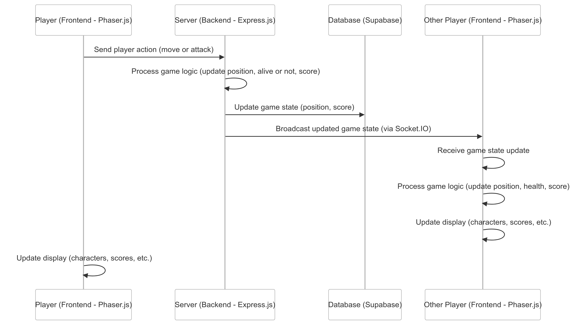
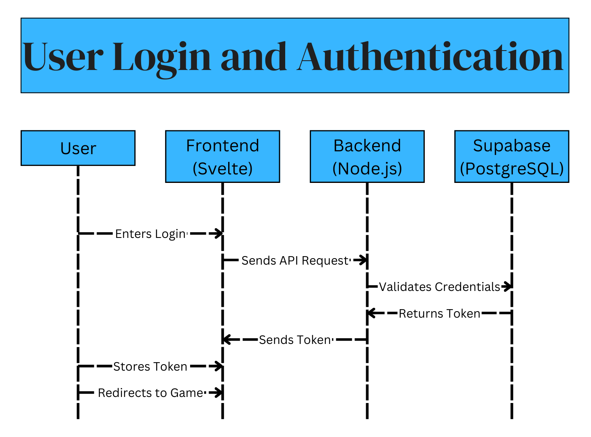

# Stage 3: Technical Documentation & System Design

## Sommaire

- [Stage 3: Technical Documentation \& System Design](#stage-3-technical-documentation--system-design)
  - [Sommaire](#sommaire)
  - [Introduction](#introduction)
    - [Purpose of this document](#purpose-of-this-document)
    - [Project overview](#project-overview)
    - [MVP scope](#mvp-scope)
  - [Task 0: User Stories \& Mockups](#task-0-user-stories--mockups)
    - [User stories (MoSCoW Prioritizations)](#user-stories-moscow-prioritizations)
    - [Mockups (Main Screens \& UI Elements)](#mockups-main-screens--ui-elements)
  - [Task 1: System Architecture](#task-1-system-architecture)
    - [High-level Architecture Diagram](#high-level-architecture-diagram)
    - [Data Flow Between Components](#data-flow-between-components)
    - [Technology Stack Overview:](#technology-stack-overview)
      - [Frontend (Client-Side):](#frontend-client-side)
      - [Backend (Server-Side):](#backend-server-side)
      - [Deployment \& Infrastructure:](#deployment--infrastructure)
      - [Scalability Considerations:](#scalability-considerations)
  - [Task 2: Components \& Database Design](#task-2-components--database-design)
    - [Core Components Overview](#core-components-overview)
      - [Backend Structure](#backend-structure)
        - [Key Classes](#key-classes)
          - [User](#user)
          - [GameSession](#gamesession)
          - [PlayerCharacter](#playercharacter)
          - [GameMap](#gamemap)
    - [Database Schema (ER Diagram)](#database-schema-er-diagram)
      - [Supabase Schema (PostgreSQL-based)](#supabase-schema-postgresql-based)
        - [Users (User Accounts)](#users-user-accounts)
        - [**Game Sessions (Active/Completed Matches)**](#game-sessions-activecompleted-matches)
        - [**Player Characters (Player Stats and Attributes)**](#player-characters-player-stats-and-attributes)
        - [**Game Map (Game World Data)**](#game-map-game-world-data)
    - [Data Flow \& Interactions](#data-flow--interactions)
      - [**Frontend UI Components**](#frontend-ui-components)
        - [**Main Components**](#main-components)
      - [**Component Interaction Flow**](#component-interaction-flow)
  - [Task 3: Sequence Diagrams](#task-3-sequence-diagrams)
    - [Gameplay Flow](#gameplay-flow)
    - [User Authentication Process](#user-authentication-process)
    - [Game Session](#game-session)
  - [Task 4: API Documentation](#task-4-api-documentation)
    - [External APIs](#external-apis)
    - [Internal API Endpoints (Routes, Inputs/Outputs)](#internal-api-endpoints-routes-inputsoutputs)
  - [Task 5: Source Control \& QA Strategy](#task-5-source-control--qa-strategy)
    - [Source Control \& QA Strategy](#source-control--qa-strategy)
      - [Version Control Strategy (Git Workflow)](#version-control-strategy-git-workflow)
      - [Testing Plan (Unit, Integration, End-to-End)](#testing-plan-unit-integration-end-to-end)
  - [Quality Assurance (QA) Strategy](#quality-assurance-qa-strategy)
  - [CI/CD \& Deployment Pipeline](#cicd--deployment-pipeline)
  - [Summary](#summary)
  - [Notes on Specific Tools:](#notes-on-specific-tools)


## Introduction

In this stage we will document the creation of the prototype and the various architecture of our project. This stage will be also useful to rework on the technologies and really think them interacting with each other and taking also in count deadlines and the technologies we saw during the Holberton course.

### Purpose of this document

This document will be important because it will be the prototype, the big guidelines to "how" we will code.

### Project overview

As a reminder: This project is a video game playable on a browser.
The concept is a "Battle royal" completly in the dark. Players will have to be tactical and cautious to be able to reach each other without being caught themselves.

### MVP scope

In the MVP we decided on:
- Functional multiplayer game with destructible map
- Basic combat system
- User authentication and management
- Basic user interface and scoreboard
- Basic game design

## Task 0: User Stories & Mockups

### User stories (MoSCoW Prioritizations)


To lighten this document, you can find all the [user stories in this link](./User_stories.md)

### Mockups (Main Screens & UI Elements)

## Task 1: System Architecture

### High-level Architecture Diagram

The purpose of this architecture is to define the interaction between core components of the MVP and ensure scalability and efficiency. It provides a structured overview of how the front-end, back-end, databases, and external services interact to create a seamless multiplayer gaming experience.


### Data Flow Between Components

**User Flow:**
1. **User Authentication**  
    - User interacts with the Svelte Frontend.  
    - Request sent to the Express Backend.  
    - Supabase handles authentication against its database.  
    - Token/session is generated and sent back to the frontend.

2. **Multiplayer Game Session**  
    - Players join a game session.  
    - Phaser.js handles real-time game logic on the frontend.  
    - Game events (movement, attacks, destruction) are sent via Socket.IO.  
    - The Express Backend processes events and updates the game state in Supabase.  
    - Updates are pushed to all connected players in real-time.

3. **Game State and Map Destruction**  
    - The game map updates dynamically based on destruction events.  
    - Backend updates game data in Supabase.  
    - Frontend receives real-time updates via WebSockets.

4. **Game End and Scoreboard**  
    - The final game state is stored in Supabase.  
    - Scoreboard is updated and displayed to all players.

### Technology Stack Overview:

#### Frontend (Client-Side):
- **Svelte**:  
  - **Why**: Svelte is a modern, lightweight, and highly efficient JavaScript framework that compiles to optimized vanilla JavaScript at build time. This leads to smaller bundle sizes and faster loading times, ensuring a smooth and responsive user experience—essential for a fast-paced game. It’s reactive nature makes it easy to build interactive UIs, which is perfect for handling real-time updates in a multiplayer environment.
  
- **Phaser.js**:  
  - **Why**: Phaser.js is a powerful and flexible game development framework specifically designed for building 2D games. It supports real-time rendering, physics, and game state management—all of which are critical for creating interactive multiplayer experiences. It provides everything needed to manage game logic, assets, and interactions efficiently, which is essential for our game's fast-paced dynamics.

- **WebSockets (Socket.IO Client)**:  
  - **Why**: Socket.IO is a robust solution for real-time communication over WebSockets. It allows low-latency, bi-directional communication between the client and server, making it ideal for synchronizing multiplayer gameplay. With Phaser.js handling game state on the frontend and Socket.IO managing the communication, we ensure that player actions (e.g., movements, attacks) and game state updates happen in real-time without noticeable lag.

#### Backend (Server-Side):
- **Node.js & Express.js**:  
  - **Why**: Node.js provides a non-blocking, event-driven environment perfect for handling multiple simultaneous connections—critical for a multiplayer game where many players interact with the server in real-time. Express.js is a lightweight and flexible framework that allows for easy routing and handling of API requests. Together, they provide the performance and scalability necessary to handle game logic, player interactions, and API requests in an efficient manner.

- **Socket.IO**:  
  - **Why**: Socket.IO is used for its ability to enable real-time, low-latency communication. For a multiplayer game, where constant synchronization of game events is needed, Socket.IO ensures that player movements, attacks, and game state updates are communicated instantly. This is vital to ensuring a smooth gameplay experience.

- **Supabase**:  
  - **Why**: Supabase provides a scalable backend solution with an easy-to-use PostgreSQL database and built-in user authentication. It offers real-time database synchronization, which is essential for maintaining game state consistency across multiple players. By leveraging Supabase's built-in authentication system, we streamline user sign-up and login processes without having to reinvent the wheel for secure user management. This lets us focus more on game logic and player interactions.

#### Deployment & Infrastructure:
- **Docker**:  
  - **Why**: Docker allows us to containerize the application, ensuring that it can run consistently across different environments. This is especially important when deploying the game to various platforms or scaling across multiple servers. With Docker, we can guarantee that all dependencies are bundled together, simplifying deployment and ensuring reliability.

- **Phaser Hosting**:  
  - **Why**: As Phaser.js is responsible for the client-side game logic, it can also handle the hosting of static files (such as game assets and frontend code) directly. This reduces complexity by removing the need for an additional hosting service for frontend files and ensures better integration with the game engine.

#### Scalability Considerations:
- **Microservices Approach**:  
  - **Why**: As the game expands, we may introduce additional services, such as matchmaking or player progression systems. A microservices architecture will allow us to scale specific components independently based on demand. For example, if the game logic requires more computational resources, we can scale that part of the system without affecting other components like authentication or matchmaking.

- **Load Balancing**:  
  - **Why**: Load balancing ensures that traffic is distributed evenly across multiple servers, preventing any one server from becoming overwhelmed. This is especially important for multiplayer games that require high availability and low latency. With solutions like Nginx or cloud-based load balancing, we can manage spikes in traffic while maintaining smooth gameplay.

- **Database Optimization**:  
  - **Why**: Supabase’s PostgreSQL database is optimized for scalability. Features like indexing and sharding will be used to handle large datasets efficiently, ensuring that we can manage player data, game states, and other dynamic information without degrading performance as the user base grows.

- **Caching with Redis**:  
  - **Why**: Redis is an in-memory data store that can be used for caching frequently accessed data, such as player stats or game states. Caching helps reduce database load and speeds up access to critical game data, providing a smoother user experience in high-demand moments.


## Task 2: Components & Database Design

### Core Components Overview

#### Backend Structure

##### Key Classes

###### User
- **Attributes**:
  - `id`: Unique identifier
  - `username`: String (unique, required)
  - `email`: String (unique, required)
  - `password_hash`: String (hashed password, required)
  - `created_at`: Timestamp
  - `last_login`: Timestamp (optional)
- **Methods**:
  - `register()`: Creates a new user
  - `authenticate()`: Verifies user credentials
  - `update_password()`: Modifies the password
  - `delete_account()`: Deletes the user

###### GameSession
- **Attributes**:
  - `id`: Unique identifier
  - `players`: List of User IDs
  - `start_time`: Timestamp
  - `end_time`: Timestamp (nullable, for ongoing sessions)
  - `winner`: User ID (nullable until the game ends)
  - `sorted_scores`: Sorts the score of all the players
- **Methods**:
  - `start_session()`: Initializes a game session
  - `add_player(user_id)`: Adds a player to the session
  - `remove_player(user_id)`: Removes a player from the session
  - `end_session(winner_id)`: Ends the session and declares a winner

###### PlayerCharacter
- **Attributes**:
  - `id`: Unique identifier
  - `user_id`: User ID reference
  - `position_x`: Float (current X coordinate)
  - `position_y`: Float (current Y coordinate)
  - `alive`: true
  - `weapon`: String (default: melee weapon) (specified for potential firearms later)
  - `killScore`: Number of kills done in the session. Usefull for the scores.
- **Methods**:
  - `move(direction)`: Updates position
  - `attack(target_id)`: Executes an attack
  - `take_damage(amount)`: Reduces health

###### GameMap
- **Attributes**:
  - `id`: Unique identifier
  - `grid`: 2D array defining the terrain
  - `darkness_level`: Integer (for light visibility calculations)
  - `destruction_timer`: Timer for progressive map destruction
- **Methods**:
  - `update_darkness()`: Modifies darkness level dynamically
  - `destroy_area(region_id)`: Removes an area from the map

---

### Database Schema (ER Diagram)

#### Supabase Schema (PostgreSQL-based)

##### Users (User Accounts)
```sql
CREATE TABLE users (
  id UUID PRIMARY KEY DEFAULT gen_random_uuid(),
  username TEXT UNIQUE NOT NULL,
  email TEXT UNIQUE NOT NULL,
  password_hash TEXT NOT NULL,
  created_at TIMESTAMP DEFAULT NOW(),
  last_login TIMESTAMP
);
```

##### **Game Sessions (Active/Completed Matches)**
```sql
CREATE TABLE game_sessions (
  id UUID PRIMARY KEY DEFAULT gen_random_uuid(),
  players UUID[] NOT NULL,
  start_time TIMESTAMP DEFAULT NOW(),
  end_time TIMESTAMP,
  winner UUID REFERENCES users(id)
);
```

##### **Player Characters (Player Stats and Attributes)**
```sql
CREATE TABLE player_characters (
  id UUID PRIMARY KEY DEFAULT gen_random_uuid(),
  user_id UUID REFERENCES users(id),
  position_x FLOAT NOT NULL,
  position_y FLOAT NOT NULL,
  alive BOOL DEFAULT true,
  weapon TEXT DEFAULT 'Melee'
);
```

##### **Game Map (Game World Data)**
```sql
CREATE TABLE game_map (
  id UUID PRIMARY KEY DEFAULT gen_random_uuid(),
  grid JSONB NOT NULL,
  darkness_level INT DEFAULT 5,
  destruction_timer INT DEFAULT 120
);
```

---

### Data Flow & Interactions

#### **Frontend UI Components**

##### **Main Components**
- **MainMenu/Index**
  - Displays the play button, login, register
  - Button to play
  - Displays real-time player rankings
- **GameCanvas**
  - HTML5 Canvas component rendering the game map and player positions
  - Manages dynamic updates via WebSockets
  - Phaser managing players actions
- **AuthenticationForm**
  - Handles user login and registration
- **Profile**
  - Displays user profile and score if registered 

#### **Component Interaction Flow**
1. **MainMenu** → Player choose to play anonymously or login/register
2. (Optional)**User Login** → Auth API verifies credentials and retrieves user data.
3. **Gameplay (GameCanvas)** → Renders map, synchronizes player movements via WebSockets and players movements/actions through Phaser.
4. **Combat System** → Player actions (attacks, movements) are processed in real-time.
5. **Game End** → The server updates `game_sessions` with the winner.


## Task 3: Sequence Diagrams

### Gameplay Flow



### User Authentication Process



### Game Session


## Task 4: API Documentation

### External APIs

- **Supabase** (PostegreSQL & Authentication)
  
  - **Purpose:**
    - Manages user authentication (sign-in, login, password reset).
    - Stores game-related data (users, games sessions, scores)
  - **Why?**
    - Provides an easy-to-use PostgreSQL backend.
    - Built-in authentication system.
    - Real-time database capabilities.
  - **Relevant Endpoints:**
    - POST /auth/v1/signup → Create a new user.
    - POST /auth/v1/token?grant_type=password → Log in a user.
    - POST /auth/v1/reset → Send password reset email.
- Socket.IO (Real-time Communication)
  - **Purpose:**
    - Enables real-time multiplayer interactions (movement, attacks, game state).
  - **Why?**
    - Efficient WebSocket-based messaging.
    - Low latency, crucial for fast-paced games.
  - **Relevant Endpoints:**
    - player_movement → Syncs movement across players.
    - attack_action → Sends attack actions in real time.
    - game_update → Broadcasts state changes to all clients.

### Internal API Endpoints (Routes, Inputs/Outputs)

- **User Authentication**
  
| Method | Endpoint           | Description                        | Input                                              | Output                                      |
|--------|--------------------|------------------------------------|---------------------------------------------------|---------------------------------------------|
| POST   | `auth/register` | Registers a new user              | `{ "email": "user@example.com", "password": "secure123" }` | `{ "user_id": "abc123", "message": "User created" }` |
| POST   | `/auth/login`    | Authenticates user and returns a token | `{ "email": "user@example.com", "password": "secure123" }` | `{ "token": "jwt_token" }` |

- **Game Management**

| Method | Endpoint                   | Description                 | Input                                             | Output                                      |
|--------|----------------------------|-----------------------------|--------------------------------------------------|---------------------------------------------|
| GET    | `/`                   | Home page: launching a game, login, signup, leaderboard   | -                                                             | `{ "leaderboard": [{"user_id": "abc123", "score": 100}, ...] }` |
| GET    | `/game/:session_id` | Fetches current game state  | URL param: `session_id`                          | `{ "players": [...], "map_state": {...} }`  |
| POST   | `/game/:session_id/end`               | End the game: show results  | `{ "session_id": "game456", "winner_id": "user789" }` | `{ "message": "Game ended" }` |

- **User**
  
| Method | Endpoint                  | Description           | Input               | Output                                          |
|--------|---------------------------|-----------------------|----------------------|------------------------------------------------|
| GET    | `/:user_id` | Fetches player stats and play button | URL param: `user_id` | `{ "games_played": 10, "wins": 3 }`            |


## Task 5: Source Control & QA Strategy

### Source Control & QA Strategy

#### Version Control Strategy (Git Workflow)
We will use **Git** with a **GitHub** repository to track changes, collaborate, and maintain code integrity.

**Proposed workflow:**  
1. **Main Branch (`main`)**: Contains only stable, production-ready code.  
2. **Develop Branch (`develop`)**: Integrates new features merged before merging into `main`. kinda a "save" of everything merged to see if it works before sending to the `main`.
3. **Feature Branches (`feature/feature-name`)**: Each new feature is developed on a separate branch before merging into `develop`. Example: feature.user-authentication.  
4. **Bugfix Branches (`bugfix/bug-name`)**: Quick fixes for issues found in staging or production. Example: bugfix/login-error.
5. **Hotfix Branches (`hotfix/hotfix-name`)**: For urgent fixes applied QUICKLY directly to `main`. Example: hotfix/server-crash.

**Best practices:**  
✅ All branches are updated through **pull requests (PRs)** and must be reviewed before merging.
✅ Frequent commits (small, atomic changes).
✅ Commits follow a **clear convention** (`feat:`, `fix:`, `refactor:`, etc.).  
✅ PRs must **pass automated tests** before merging.  

---

#### Testing Plan (Unit, Integration, End-to-End)
To ensure code quality, we implement multiple levels of testing:  

1. **Unit Tests**  
   - Validate the correct behavior of **individual functions and components**.  
   - Executed using **Vitest** (for JavaScript logic) and **Svelte Testing Library** (for UI components).  

2. **Integration Tests**  
   - Ensure that different components work correctly together (API + database).  
   - Performed using **Postman** [Note: Postman or else, I'm still looking through all the possible extension and test application such as Keploy, thunderClient or rest client.], Vitest (backend & frontend), and Playwright (UI interactions)**.  

3. **End-to-End (E2E) Tests**  
   - Simulate real user scenarios to test the entire application.  
   - Automated using **Playwright** for UI interactions.  


💡 **Strategy**: Tests are automated with **GitHub Actions** and must pass before deployment.  

---

## Quality Assurance (QA) Strategy

| **Test Type**             | **Purpose**                              | **Tools Used**                             | **Scope**                                    |
|---------------------------|------------------------------------------|--------------------------------------------|----------------------------------------------|
| **Unit Tests**             | Verify individual components/functions   | Jest, Mocha (for Node.js)                  | API endpoints, utility functions, Svelte components |
| **Integration Tests**      | Ensure APIs work together correctly      | Supertest, Postman (optional for manual API testing) | Backend services interacting with Express & Supabase  |
| **End-to-End (E2E) Tests** | Validate user workflows                  | Cypress, Playwright (for Svelte apps)      | User authentication, gameplay interactions   |
| **Performance Testing**    | Test system under load                   | k6, Artillery                              | API response times, WebSocket efficiency     |
| **Manual Testing**         | Exploratory testing for edge cases       | QA testers                                 | UI, UX, and gameplay mechanics in Phaser and Svelte |

---

## CI/CD & Deployment Pipeline

1. **GitHub Actions for CI/CD**
   - Runs unit & integration tests automatically on push.
   - Deploys to staging on merging to `develop`.
   - Deploys to production on merging to `main`.

2. **Environments**
   - **Local Development** → Developers test on local machines using `.env.local`.
   - **Staging (Test Server)** → Pre-production environment for QA testing.
   - **Production** → Live environment used by players.

---

## Summary

- **SCM Strategy:**
  - Git + GitHub
  - Feature-based branching
  - Pull requests with code reviews

- **QA Strategy:**
  - Automated tests: Jest, Mocha, Cypress, Playwright, Supertest
  - Manual testing for UX & gameplay
  - Continuous Integration with GitHub Actions

---

## Notes on Specific Tools:
- **Jest/Mocha** : These tools are great for testing specific functions (like APIs or utilities). Mocha can also be used with **Chai** for assertions, which is common for tests in Node.js.
- **Supertest** : Perfect for testing APIs with Express.
- **Cypress / Playwright** : These tools are better suited for frontend applications like those built with **Svelte** and **Phaser**. They allow simulating real users to test UI interactions.
- **k6 / Artillery** : These tools allow performance testing by simulating real users and measuring response times of APIs and systems.
